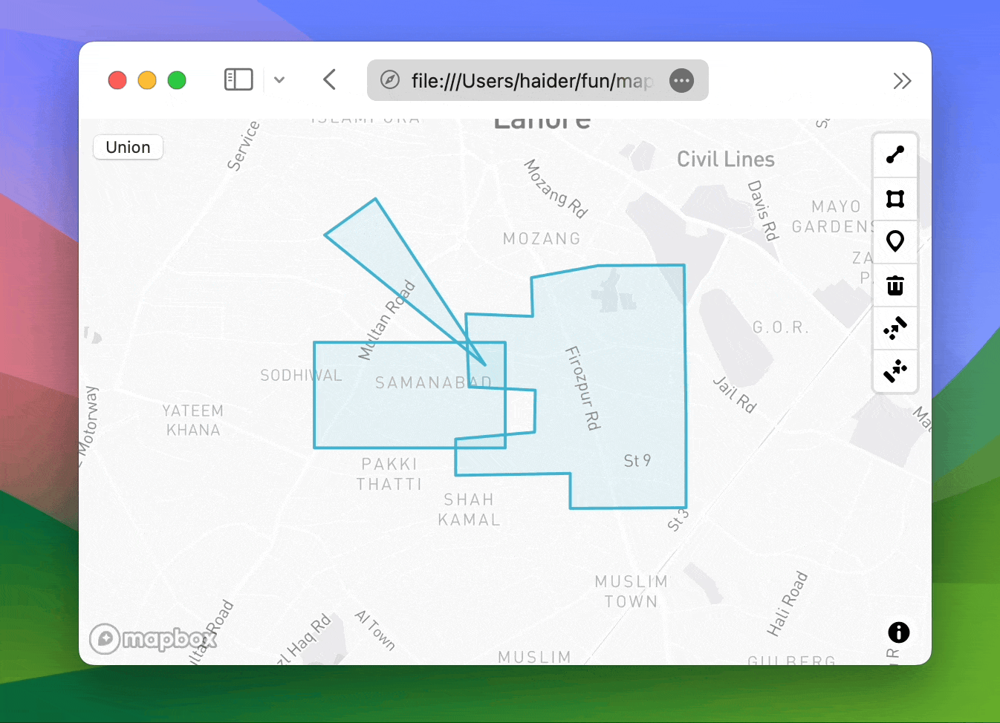

## mapbox-gl-draw-union-mode

Simple custom mode for `mapbox-gl-draw` that combines selected
Polygons into a single Polygon.

<p align="center">
    
</p>

### Installation

TODO: publish to npm & cdn

### Usage

1. Add the mode to your mapbox-gl-draw instance:

```javascript
import MapboxDraw from '@mapbox/mapbox-gl-draw';
import UnionMode from 'mapbox-gl-draw-union-mode';

const draw = new MapboxDraw({
    modes: Object.assign(MapboxDraw.modes, {
        union: UnionMode
    })
});
```

2. Use the mode in your mapbox-gl-draw instance:

```javascript
draw.changeMode('union');
```

After selecting multiple Polygons, simply change the mode to `union`, and the selected Polygons will be combined into a single Polygon!


### Options
You can pass a function to handle how you want the **properties** of the combined Polygon to be merged. By default, it uses `Object.assign` to combine the properties of the selected Polygons.

It should be a function that takes two properties and returns a single property, for example:

```javascript
/**
 * Merge two properties
 * @param {Object} prop1
 * @param {Object} prop2
 * @returns {Object} The merged properties
 */
function (prop1, prop1) { ... }
```

and then use it like this:

```javascript
draw.changeMode('union', { propertyUnionFn: yourMergeFunction });
```


### Disclaimer
If you ended up taking the union of non-intersecting Polygons, the resulting Polygon will be a MultiPolygon with the original Polygons as its members.

This mode only handles `Polygon` types, so you won't be able to combine the resulting MultiPolygon with other Polygons.

To fix, You can convert them back into individual Polygons using the "Uncombine Features" mode in `mapbox-gl-draw` and then combine them again after moving them to intersect.
